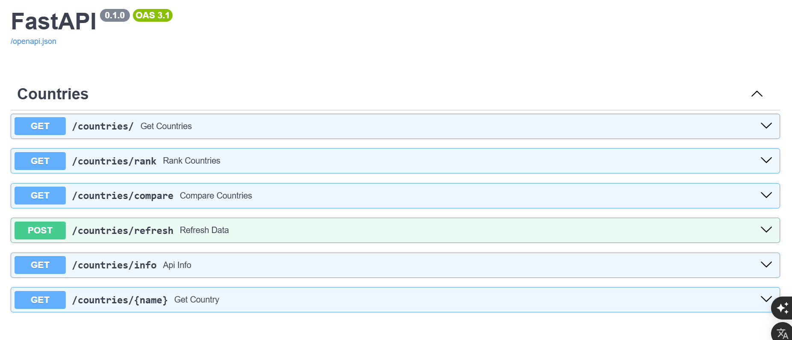

# Country Info API

A RESTful API built with **FastAPI**, **SQLAlchemy 2.0**, and **SQLite** that provides country information, statistics, comparison, ranking, and searching capabilities using data scraped from Worldometers.

---

## Features

- Import country data using a web scraper
- Refresh the database with the latest scraped data
- Retrieve all countries
- Retrieve a country by name
- Compare two countries
- Dynamic ranking by different metrics
- Country statistics and population insights
- Search countries by name
- Dynamic sorting
- Pydantic request and response validation
- Proper HTTP status codes and exception handling
- Interactive API documentation with Swagger UI

---

## Tech Stack

- Python 3.11
- FastAPI
- SQLAlchemy 2.0
- SQLite
- BeautifulSoup4
- Requests
- Pydantic v2
- Uvicorn

---

## Project Structure

```text
country-info-api/
├── assets/
│   └── swagger.png
├── routes/
│   └── countries.py
├── database.py
├── models.py
├── schemas.py
├── scraper.py
├── main.py
├── requirements.txt
├── .gitignore
└── README.md
```

---

## Installation

Clone the repository:

```bash
git clone https://github.com/qw3rty-dev/country-info-api.git
```

Navigate to the project directory:

```bash
cd country-info-api
```

Create a virtual environment:

```bash
python -m venv venv
```

Activate the virtual environment.

**Windows**

```bash
venv\Scripts\activate
```

**Linux/macOS**

```bash
source venv/bin/activate
```

Install dependencies:

```bash
pip install -r requirements.txt
```

Run the development server:

```bash
uvicorn main:app --reload
```

---

## API Documentation

Once the server is running, visit:

```text
http://127.0.0.1:8000/docs
```

to explore the interactive Swagger UI.

---

##  Preview



---

##  API Endpoints

| Method | Endpoint | Description |
|--------|----------|-------------|
| GET | `/countries` | Retrieve all countries |
| GET | `/countries/{country_name}` | Retrieve a country by name |
| GET | `/countries/compare` | Compare two countries |
| GET | `/countries/rank` | Rank countries by a selected metric |
| GET | `/countries/stats` | Retrieve global country statistics |
| POST | `/countries/refresh` | Refresh the database with the latest scraped data |

---

## Example Requests

```http
GET /countries?search=ind

GET /countries?sort=population

GET /countries?sort=name&descending_order=true

GET /countries/compare?first_name=India&second_name=China

GET /countries/rank?metric=population

GET /countries/rank?metric=density&descending_order=true

GET /countries/stats

POST /countries/refresh
```

---

## API Capabilities

- SQLAlchemy 2.0 ORM
- Dynamic filtering and searching
- Dynamic sorting and ranking
- Aggregate queries and statistics
- Country comparison
- Web scraping with BeautifulSoup
- Session management
- Enum-based request validation
- Pydantic request & response models
- SQLite database integration

---

## Learning Highlights

This project demonstrates:

- SQLAlchemy 2.0 ORM
- Web scraping and data parsing
- REST API design
- Session management
- Dynamic query construction
- Aggregate functions
- Response validation using Pydantic
- Exception handling and HTTP status codes

---

## Future Improvements

- PostgreSQL support
- JWT Authentication
- Pagination
- Redis caching
- Scheduled automatic database refresh
- Docker support
- Automated testing

---
